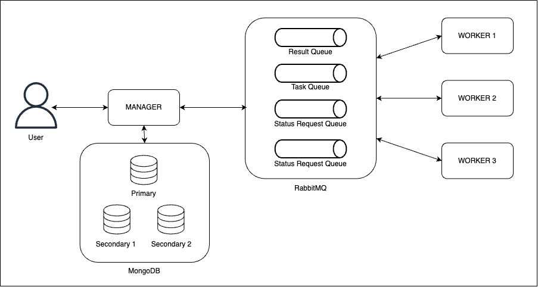

# CrackHash 2.0 — Распределённая отказоустойчивая система для brute-force MD5-хэшей

## Описание  

CrackHash — это распределённая система, реализующая brute-force перебор MD5-хэшей. Система состоит из менеджера, воркеров, базы данных (MongoDB) и очереди сообщений (RabbitMQ)

## Технологии  

- **Node.js** (чистый JS)  
- **MongoDB** - через библиотеку mongoose
- **RabbitMQ** - через библиотеку amqplib
- **Express** — REST API  
- **Dotenv** — управление конфигурацией  
- **Worker_threads** — многопоточная обработка  
- **Crypto** — вычисление MD5  
- **Axios** — HTTP-запросы между сервисами  
- **Uuid** — генерация уникальных идентификаторов  

## Структура проекта  

```
Lab2/
│
├── manager/
│   ├── src/
│   │   ├── models/
│   │   │   └── task.js
│   │   ├── rabbitMQ/
│   │   │   ├── rabbit.js
│   │   ├── config.js
│   │   ├── database.js
│   │   ├── index.js
│   │   ├── routes.js
│   │   └── services.js
│   ├── .env
│   ├── .env.example
│   ├── Dockerfile
│   ├── package-lock.json
│   └── package.json
│
├── worker/
│   ├── src/
│   │   ├── rabbitMQ/
│   │   │   └── rabbit.js
│   │   ├── config.js
│   │   ├── index.js
│   │   ├── services.js
│   │   └── worker.js
│   ├── Dockerfile
│   ├── package-lock.json
│   └── package.json
│
├── .env
├── .env.example
├── .gitignore
├── docker-compose.yml
├── mongo-keyfile
└── README.md
```

## Документация
### Установка  

1. **Клонирование репозитория:**  
    ```sh
    git clone https://github.com/SP4YD/CrackHash.git
    cd Lab2
    ```
2. **Установка зависимостей для менеджера и воркера:**
    ```sh
    cd ./worker
    npm install
    cd ..
    cd ./manager
    npm install
    ```
3. **Настройка переменных окружения:**

    Создайте .env файлы в manager/ используя .env.example как шаблон.
4. **Запуск и сборка сервисов из папки Lab2:**
    ```sh
    docker-compose up --build
    ```
5. **Для запуска без сборки используйте:**
    ```sh
    docker-compose up
    ```

## Особенности реализации MongoDB и RabbitMQ
### MongoDB (Replica Set)
1. Для обеспечения отказоустойчивости используется реплицируемый кластер MongoDB, состоящий из:

    1 primary-ноды

    2 secondary-нод

2. Все записи задач и результатов сохраняются в базу и подтверждаются только после успешной репликации на вторичные узлы.

3. В случае сбоя primary-ноды, MongoDB автоматически назначает новую primary и продолжает работу без потерь данных.

4. Репликация обеспечивается с помощью встроенного механизма Replica Set и конфигурируется в Docker-окружении.

### RabbitMQ (Direct Exchange + Persistence)
1. Для обмена сообщениями между компонентами используется RabbitMQ, настроенный с использованием:

    Direct Exchange для маршрутизации сообщений между менеджером и воркерами.

    Двух очередей: одна для задач, другая для результатов.

2. Все сообщения являются персистентными (persistent), что гарантирует их сохранность при рестартах или сбоях RabbitMQ.

3. В случае недоступности очереди:

    Менеджер сохраняет задачи во внутреннюю базу данных и автоматически отправляет их после восстановления связи.

4. Используется механизм acknowledgement для обработки отказов воркеров:

    Если воркер не подтвердил получение задачи, она возвращается в очередь и может быть обработана другим воркером.

## API
### 1. Взлом хэша
Отправка задачи на взлом MD5-хэша.
#### Запрос:
```
POST /api/hash/crack
Content-Type: application/json
```
Body:
```
{
    "hash": "e2fc714c4727ee9395f324cd2e7f331f",
    "maxLength": 5
}
```
#### Ответ:
```
{
    "requestId": "0baf6274-164e-49f2-89c3-279e60d2adeb"
}
```
### 2. Проверка статуса задачи
Получение статуса текущей задачи.
#### Запрос:
```
GET /api/hash/status?requestId=0baf6274-164e-49f2-89c3-279e60d2adeb
```
#### Ответ (если задача в процессе):
```
{
    "status": "IN_PROGRESS",
    "data": null,
    "percentage": "52.03%"
}
```
#### Ответ (если задача завершена):
```
{
    "status": "READY",
    "data": ["abcd"]
}
```

## Как работает распределение задач?  

- **Менеджер** принимает задачу и делит диапазон перебора между **воркерами**.  
- Каждый **воркер** вычисляет MD5 для своей части и отправляет результаты менеджеру.  
- Когда все воркеры отработали, менеджер фиксирует результат и отдает клиенту.  